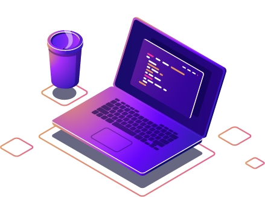

<!-- Introduction -->

  
  <ul>
    <li>Hi! I'm Emily, a 30yo brazilian from a Social Sciences and design background migrating to IT.</li>
    <li>I'm currently a freelance web developer, working at a marketing company, <a href="https://www.linkedin.com/company/colativo/">Colativo</a>.</li>
    <li>I'm self-taught through bootcamps, online documentation and free webcourses. My goal is to acquire the knowledge and experience needed to be a full stack developer.</li>
    <li>Feel free to check my <a href="https://www.linkedin.com/in/matiasemily/overlay/1635543546657/single-media-viewer/?profileId=ACoAADqMZOMBNhvwWZbi9ilI_2fx-xD7lRdj5pA">resume on LinkedIn</a>, as well!</li>
  </ul>

<!-- Socials section -->

      
    
    
    
      
    

<!-- Projects section -->
---

- [Rita (homologation)](https://fc.tmp.br/rita)
- [Humana Academy](https://fc.tmp.br/humana)
- [Blog Sabin](https://blog.sabin.com.br/)  

<!-- Technologies -->

    
    
    
    
    
    
    
    
    
    
      

<!-- Public stats section -->
---

  
    
  
  
   

<!-- Thank you section -->

  
Resources I'm thankful for!

    
  <table align="center">
    <thead align="center">
      <tr>
        <td><b>Name</b></td>
        <td><b>Contribution</b></td>
      </tr>
    </thead>
    <tbody>
      <tr>
        <td><a href="https://shields.io/" target="_blank">Shields Project</a></td>
        <td>Shields to create profile badges, compatible with Simple Icons</td>
      </tr>
      <tr>
        <td><a href="https://github.com/simple-icons/simple-icons#cdn-usage" target="_blank">Simple Icons</a></td>
        <td>SVG icons for popular brands</td>
      </tr>
      <tr>
        <td><a href="https://readme-typing-svg.herokuapp.com/" target="_blank">Readme Typing SVG</a></td>
        <td>Animated SVG text, which I used on titles here</td>
      </tr>
      <tr>
        <td><a href="https://github.com/antonkomarev/github-profile-views-counter/" target="_blank">GitHub Profile Views Counter</a></td>
        <td>Dynamic badges to count visitors on your GitHub profile</td>
      </tr>
      <tr>
        <td><a href="https://github.com/anuraghazra/github-readme-stats" target="_blank">GitHub Readme Stats</a></td>
        <td>More dynamic badges with GitHub stats</td>
      </tr>
      <tr>
        <td><a href="https://github.com/ryo-ma/github-profile-trophy" target="_blank">GitHub Profile Trophy</a></td>
        <td>Cool trophies with dynamic GitHub stats</td>
      </tr>
    </tbody>
  </table>

